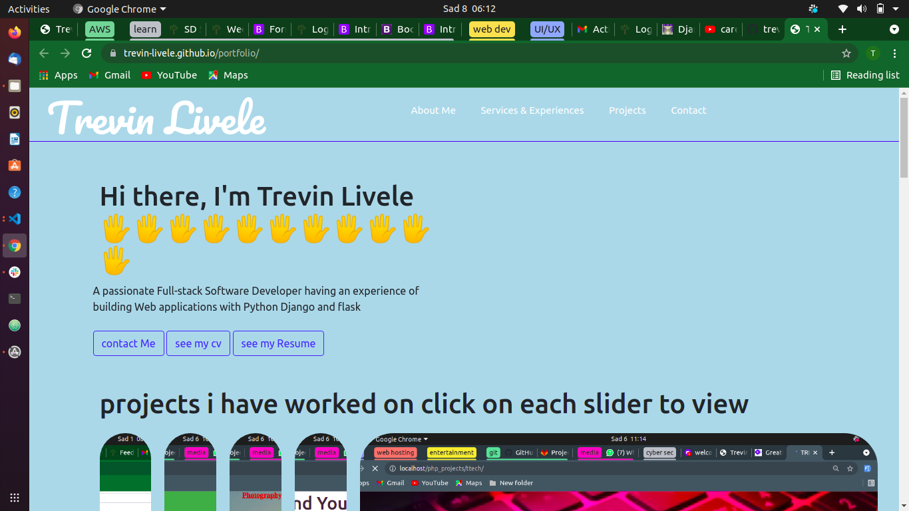

#read me file

# Team members
Trevin Livele

## project description
This is a portfolio website meant for the purposes of moringa class room assignent 
and job application in the future

### copyright licence

This is an open source project that anyone can feel free to edit,modify and push to git hub freely.

## Technologies Used
Used html to create the layout of the page,used css and bootstrap for the styling purposes and js for the
projects done section"

.HTML
.CSS
.BOOTSTRAP
.JAVASCRIPT

## Support and contact details
Trevin Livele - Full stack software developer
Information Technology Expert
+254792691810

### Link to github pages

https://trevin-livele.github.io/portfolio/

### License
Copyright (c) {2021} **{Trevin Livele}**
  